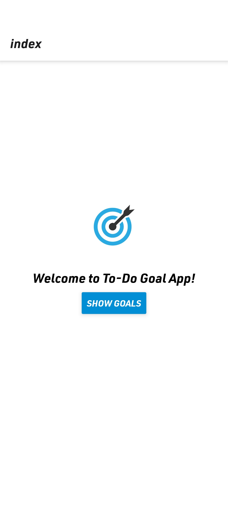
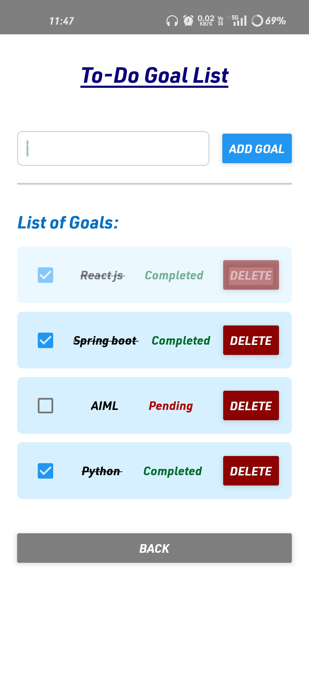

# 🎯 Goal Tracker - Your Personal Todo App

> **Turn your dreams into achievable goals!** 

A sleek and intuitive React Native todo app built with Expo that helps you track your goals and stay productive. Whether you're planning daily tasks or long-term objectives, Goal Tracker keeps you organized and motivated!


## ✨ Features

- **📝 Add Goals**: Easily create new goals with a simple text input
- **✅ Mark Complete**: Check off completed goals with satisfying checkboxes
- **🗑️ Delete Goals**: Remove goals you no longer need
- **📱 Responsive Design**: Beautiful UI that works on all screen sizes
- **🎨 Modern Interface**: Clean, intuitive design with smooth animations
- **💾 Real-time Updates**: Instant feedback when you interact with your goals
- **🌟 Status Tracking**: Visual indicators for pending vs completed goals

## 📱 Screenshots

### Main Welcome Screen


### Goal Management Interface


### For Mobile 

div align="center">
  
  
</div>

### Preview 

div align="center">
  
</div>


The app features a clean, intuitive interface with:
- **Welcome screen** with app logo and entry point
- **Modal-based goal management** for focused interaction
- **Visual status indicators** (Pending/Completed with color coding)
- **Interactive checkboxes** for marking goals complete
- **Delete functionality** for removing unwanted goals

## 🚀 Quick Start

### Prerequisites

- Node.js (v14 or higher)
- npm or yarn
- Expo CLI (`npm install -g @expo/cli`)

### Installation

1. **Clone the repository**
   ```bash
   git clone https://github.com/mohanapriyan2006/Goal-Tracker.git
   cd Goal-Tracker
   ```

2. **Install dependencies**
   ```bash
   npm install
   ```

3. **Start the development server**
   ```bash
   npx expo start
   ```

4. **Run on your device**
   - **iOS Simulator**: Press `i` in the terminal
   - **Android Emulator**: Press `a` in the terminal  
   - **Physical Device**: Scan the QR code with Expo Go app
   - **Web Browser**: Press `w` in the terminal

## 🛠️ Tech Stack

- **Framework**: React Native 0.79.6
- **Development Platform**: Expo ~53.0.22
- **UI Components**: React Native Core Components
- **Navigation**: Expo Router
- **State Management**: React Hooks (useState)
- **Styling**: StyleSheet API
- **Icons**: Custom checkbox component

## 📂 Project Structure

```
Goal-Tracker/
├── app/
│   ├── index.jsx          # Main welcome screen
│   ├── GoalsModal.jsx     # Modal for managing goals
│   ├── GoalItems.jsx      # Individual goal item component
│   └── _layout.tsx        # App navigation layout
├── assets/
│   └── images/
│       └── goal.jpg       # App icon and splash screen
├── package.json           # Dependencies and scripts
└── app.json              # Expo configuration
```

## 🎮 How to Use

1. **Launch the app** and tap "Show Goals" on the welcome screen
2. **Add a new goal** by typing in the text input and pressing "Add Goal"
3. **Mark goals as complete** by tapping the checkbox next to any goal
4. **Delete goals** by pressing the red "Delete" button
5. **Go back** to the main screen using the "back" button

## 🔧 Available Scripts

- `npm start` - Start the Expo development server
- `npm run android` - Run on Android device/emulator
- `npm run ios` - Run on iOS device/simulator
- `npm run web` - Run in web browser
- `npm run lint` - Run ESLint code checking

## 🤝 Contributing

Contributions are welcome! Feel free to:

- 🐛 Report bugs
- 💡 Suggest new features
- 🔧 Submit pull requests
- 📖 Improve documentation

### Development Setup

1. Fork the repository
2. Create a feature branch (`git checkout -b feature/amazing-feature`)
3. Commit your changes (`git commit -m 'Add amazing feature'`)
4. Push to the branch (`git push origin feature/amazing-feature`)
5. Open a Pull Request

## 📄 License

This project is licensed under the MIT License - see the [LICENSE](LICENSE) file for details.

## 👨‍💻 Author

**Mohanapriyan** - [GitHub](https://github.com/mohanapriyan2006)

## 🙏 Acknowledgments

- Built with ❤️ using React Native and Expo
- Inspired by the need for simple, effective goal tracking
- Thanks to the React Native and Expo communities

---

⭐ **Star this repo if you found it helpful!** ⭐

*Happy goal tracking! 🎯*
